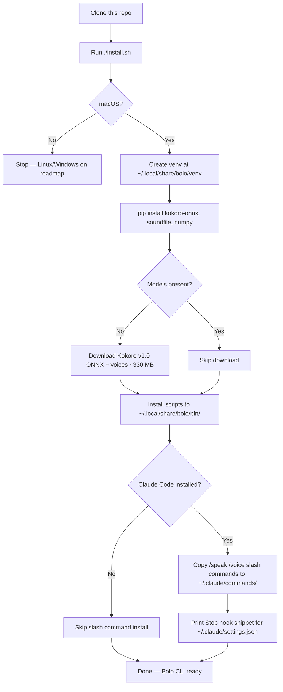
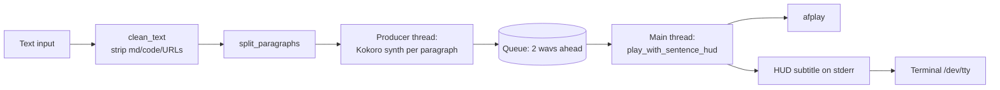

# Bolo — your terminal talker

> Local TTS for the terminal — Kokoro voice with a live subtitle HUD synced to playback.

Bolo (Hindi: *"speak"*) reads any text aloud through your terminal using a fully local Kokoro TTS model — no API calls, no tokens, no network. While the audio plays, a single-line subtitle HUD appears in the input area at the bottom of your terminal and advances in sync with the voice, so you can glance down to see exactly where in the text the voice is right now without having to re-read from the top.

**Designed for terminal-native AI agents.** Bolo reads responses from agentic CLIs out loud — Claude Code, Hermes, Codex CLI, Aider, Cursor's terminal, Open Hands, and any other agent that prints to a terminal. Claude Code has the deepest integration: auto-read via Stop hook, plus `/speak`, `/voice`, and `/hush` slash commands. Other agents use the `bolo` CLI directly or via a tool-specific skill — see [`docs/usage.md`](./docs/usage.md).

**Also useful as a plain terminal tool**, with no agent required. Pipe any text in: `cat article.md | bolo`, `pbpaste | bolo`, `curl -s url | bolo`. Listen to docs and articles while you write code in another window, get accessibility-friendly read-aloud for low-vision users, or use it for dictation-driven workflows where you want eyes free.

54 voices across 9 languages. Mac-only for v0.1 — Linux and Windows on the roadmap.

---

## Features

- **Fully local.** Kokoro v1.0 ONNX model runs on-device. No network calls. No tokens. $0/month.
- **Live subtitle HUD.** A single line at the bottom of your terminal shows the current sentence as it plays. Pinned in place — never wraps, never scrolls, never collides with the response above.
- **Sentence-accurate sync.** Word and punctuation-weighted timing keeps the subtitle aligned with the voice even on long, comma-heavy prose.
- **Smooth paragraph prosody.** Each paragraph synthesised in one Kokoro call so the audio flows naturally — no robotic per-sentence breaks.
- **Pipelined synthesis.** Producer-consumer queue means the next paragraph is synthesised in a background thread while the current one plays. Zero gaps between paragraphs after the first.
- **Claude Code integration.** Stop hook auto-reads each response. Slash commands `/speak`, `/voice`. Works in Warp, iTerm2, and the macOS terminal.
- **54 voices, 9 languages.** American, British, Hindi, Spanish, French, Italian, Japanese, Mandarin, Portuguese — both genders.

---

## Where it works

| Surface | Audio playback | Live HUD subtitle | Slash commands |
|---|---|---|---|
| **Claude Code CLI** (Warp / iTerm2 / Terminal.app) | ✓ | ✓ | ✓ |
| **Claude Code Desktop** (Mac & Windows) | ✓ | ✗ — no terminal stderr | ✓ |
| **Claude Code Web** (claude.ai/code) | ✗ — hooks don't run in browser sandbox | ✗ | ✗ |
| **VS Code / JetBrains extension** | ✓ if Stop hook fires (CLI must also be installed) | only if extension surfaces a terminal pane | ✓ |
| **Other agent CLIs** (Hermes, Aider, Open Hands, Cursor terminal) | ✓ via direct `bolo` invocation | ✓ when invoked from a real terminal | varies — see [`docs/usage.md`](./docs/usage.md) |
| **Standalone (no agent at all)** | ✓ | ✓ | n/a |

The HUD subtitle requires a real terminal to render its ANSI escape codes — it cannot draw inside a web chat panel or a non-terminal desktop UI. Audio plays through the system speaker regardless of where Bolo is invoked from. So in Claude Code Desktop you will hear the voice but not see the subtitle; in the CLI you get both.

---

## Demo

### 🔊 With audio (recommended)

https://github.com/sumanthmukkala/bolo/raw/main/assets/demo-audio.mp4

Click to hear the voice and watch the HUD subtitle pin to the bottom of the terminal, advance per sentence in sync with the audio, and get cut mid-sentence by `bolo --hush`.

### 👁 Silent visual (loads instantly)


The HUD rewrites itself in place as the voice progresses. Asciinema captures terminal text only, not audio — install Bolo locally to hear the voice. The MP4 above carries both.

---

## How install works



---

## Requirements

### Hardware

- **macOS** — Apple Silicon (M1 / M2 / M3 / M4 / M5) recommended for sub-second warm synthesis. Bolo was built and primarily tested on an M5 MacBook. Intel Macs work but synthesis is 2–4× slower.
- **RAM:** 1.5 GB free during synthesis (model + ONNX runtime + audio buffers).
- **Disk:** ~400 MB total — Kokoro model (~310 MB) + voices file (~28 MB) + venv (~60 MB).
- **Audio output** — any Mac speaker or paired Bluetooth/output device.

### Software

| Component | Minimum | Notes |
|---|---|---|
| **macOS** | 11 Big Sur | tested on Sonoma & Sequoia |
| **Python** | 3.10 | the system `python3` on stock macOS is 3.9 — install a newer one (see below) |
| `afplay` | bundled | ships with macOS |
| `curl`   | bundled | ships with macOS |
| `jq`     | optional but recommended | `brew install jq` (only needed for Stop-hook auto-read flow) |
| **Claude Code** | optional | needed only for `/speak` & `/voice` slash commands and the Stop-hook integration |

### Installing Python 3.10+

The `python3` that ships with macOS is 3.9 and will not work. Install a newer Python via Homebrew:

```bash
brew install python@3.12   # or python@3.11, python@3.13
```

`install.sh` auto-detects any of `python3.13`, `python3.12`, `python3.11`, `python3.10` on your `PATH` (in that order) and falls back to plain `python3` only if it is ≥3.10. You do not need to make the new Python your default `python3` — Bolo's venv pins to whichever interpreter the installer found.

### Network

Required only during install for the one-time model download (~330 MB combined). After that, Bolo runs fully offline.

---

## Install

```bash
git clone https://github.com/sumanthmukkala/bolo.git
cd bolo
./install.sh
```

The installer:

1. Creates a virtualenv at `~/.local/share/bolo/venv`
2. Installs Python dependencies (`kokoro-onnx`, `soundfile`, `numpy`)
3. Downloads the Kokoro ONNX model and voices file (one-time, ~330 MB combined)
4. Copies the Bolo scripts into `~/.local/share/bolo/bin/`
5. Writes a default `config.json` if none exists
6. If Claude Code is installed, copies `/speak` and `/voice` slash commands into `~/.claude/commands/`
7. Optionally prints the Stop-hook snippet for `~/.claude/settings.json`

To put `bolo` on your PATH:

```bash
echo 'export PATH="$HOME/.local/share/bolo/bin:$PATH"' >> ~/.zshrc
source ~/.zshrc
```

---

## Controls

The full table — everything you can do, in every environment.

| What you want | Claude Code (slash) | Standalone CLI / any terminal |
|---|---|---|
| **Speak text now** | `/speak <text>` | `bolo "<text>"` &nbsp;or&nbsp; `echo "<text>" \| bolo` |
| **Read last response** | `/speak last` | (Claude Code only) |
| **Auto-read every response — ON** | `/speak auto on` | `jq '.auto_read=true' ~/.local/share/bolo/config.json \| sponge ~/.local/share/bolo/config.json` |
| **Auto-read every response — OFF** | `/speak auto off` | `jq '.auto_read=false' ~/.local/share/bolo/config.json \| sponge ~/.local/share/bolo/config.json` |
| **Hush — full dead stop on current response** | `/hush` | `bolo --hush` |
| **Skip current paragraph, continue rest** | `/hush para` | `bolo --skip-paragraph` |
| **Stop audio without aborting Bolo** *(rarely needed)* | `/speak stop` | `killall afplay` |
| **Skip the NEXT assistant turn's auto-read** | `/speak skip` | `bolo --skip-next-turn` |
| **List all 54 voices** | `/voice list` | `bolo --list-voices` |
| **Switch active voice** | `/voice <name>` | edit `active_voice` in `~/.local/share/bolo/config.json` |
| **Preview a voice (no switch)** | `/voice sample <name>` | `bolo --voice <name> "Hello, this is <name>"` |
| **One-off voice override** | (use sample, then switch) | `bolo --voice af_bella "Different voice"` |
| **One-off speed override** | — | `bolo --speed 1.2 "Faster"` |
| **Show current config** | `/speak` (no args) | `cat ~/.local/share/bolo/config.json` |
| **Show version + license** | — | `bolo --version` |

### Quick examples

```bash
# Standalone reading
bolo "Hello world."
cat article.txt | bolo
curl -s https://example.com/article.txt | bolo
pbpaste | bolo                            # macOS clipboard
bolo --speed 1.4 "$(cat long-document.txt)"
```

### Enabling auto-read in Claude Code

Add this Stop hook entry to `~/.claude/settings.json`:

```json
{
  "hooks": {
    "Stop": [
      {
        "hooks": [
          { "type": "command", "command": "$HOME/.local/share/bolo/bin/stop-hook.sh" }
        ]
      }
    ]
  }
}
```

Then run `/speak auto on` once. Every assistant response will read aloud with the live HUD subtitle until you `/speak auto off`.

### Silencing fast (mid-playback)

Three paths, in order of speed:

1. **`/hush` slash command** in Claude Code — five keystrokes, kills audio + skips next auto-read.
2. **Type any character + Enter** in the active Claude Code session. The `UserPromptSubmit` hook fires `kill-on-submit.sh` before your message reaches the model, so audio dies the moment you press Enter. Use this when you want to send a follow-up turn anyway.
3. **`bolo --hush`** in any terminal tab or window — silences from outside the active Claude Code session, no turn burned.

### Optional: shell aliases (faster than slash commands)

The fastest path to silence is a plain shell alias — no Claude Code parsing, no tool-permission step, just direct exec. Add to your `~/.zshrc` (or `~/.bashrc`):

```bash
alias hush='~/.local/share/bolo/bin/bolo --hush'
alias skip='~/.local/share/bolo/bin/bolo --skip-paragraph'
```

Then `source ~/.zshrc` or open a new shell. Now from any terminal: `hush` for full stop, `skip` for paragraph skip. Four keystrokes, zero latency.

### Optional: OS-level keyboard shortcut

To silence Bolo from anywhere on your Mac without switching context, bind a hotkey:

**Karabiner-Elements** — add to `~/.config/karabiner/karabiner.json` under your active profile's `complex_modifications.rules`:

```json
{
  "description": "Bolo hush — kill audio + skip next",
  "manipulators": [
    {
      "from": { "key_code": "f13" },
      "to": [{ "shell_command": "$HOME/.local/share/bolo/bin/bolo --hush" }],
      "type": "basic"
    }
  ]
}
```

Replace `f13` with whatever key you want. Now any time audio plays, one keystroke from anywhere on your system silences it.

**macOS Shortcuts.app** — create a shortcut that runs `~/.local/share/bolo/bin/bolo --hush` and assign a global keyboard trigger in System Settings → Keyboard → Keyboard Shortcuts → Services.

### Other environments (Hermes, Cursor, Aider, etc.)

The CLI works anywhere. For agent-specific integration (where `/speak` is not natively available, or where you want auto-read on agent Stop events), see [`docs/usage.md`](./docs/usage.md) for per-environment recipes.

---

## Configuration

`~/.local/share/bolo/config.json`:

```json
{
  "active_voice": "am_michael",
  "auto_read": false,
  "speed": 1.0,
  "skip_code_blocks": true,
  "skip_urls": true,
  "max_chars_per_chunk": 250,
  "hud": true
}
```

| Field | Default | Purpose |
|---|---|---|
| `active_voice` | `am_michael` | Voice id (see `/voice list`) |
| `auto_read` | `false` | Auto-read on Claude Code Stop hook |
| `speed` | `1.0` | Playback rate (0.5–2.0) |
| `skip_code_blocks` | `true` | Strip code blocks before synthesis |
| `skip_urls` | `true` | Replace URLs with `(link)` |
| `max_chars_per_chunk` | `250` | Cap for the runaway-sentence safety split |
| `hud` | `true` | Show the live subtitle line |

---

## Voices

54 voices across 9 languages. Naming convention: `[language][gender]_<name>`.

| Prefix | Language | Gender | Voices |
|---|---|---|---|
| `af_*` | American English | female | alloy, aoede, bella, heart, jessica, kore, nicole, nova, river, sarah, sky |
| `am_*` | American English | male | adam, echo, eric, fenrir, liam, michael, onyx, puck, santa |
| `bf_*` | British English | female | alice, emma, isabella, lily |
| `bm_*` | British English | male | daniel, fable, george, lewis |
| `ef_*` / `em_*` | Spanish | f / m | dora; alex, santa |
| `ff_*` | French | female | siwis |
| `hf_*` / `hm_*` | Hindi | f / m | alpha, beta; omega, psi |
| `if_*` / `im_*` | Italian | f / m | sara; nicola |
| `jf_*` / `jm_*` | Japanese | f / m | alpha, gongitsune, nezumi, tebukuro; kumo |
| `pf_*` / `pm_*` | Portuguese | f / m | dora; alex, santa |
| `zf_*` / `zm_*` | Mandarin | f / m | xiaobei, xiaoni, xiaoxiao, xiaoyi; yunjian, yunxi, yunxia, yunyang |

Recommended starting voices: `am_michael` (default, neutral American male), `am_puck` (warm), `af_bella` (clear American female), `bm_george` (British male).

`bolo --list-voices` prints the full grouped list at any time.

---

## Latency

Measured on M5 MacBook (Apple Silicon, M-series numbers should be similar):

| Phase | Time |
|---|---|
| Cold start (first invocation, model load) | 3–5 s |
| Warm synthesis per paragraph | ~0.5–1 s |
| Audio time-to-first-sound | ~150 ms after synth completes |
| Per-paragraph gap during playback | ~0 ms (pipelined synth in background thread) |

The first response on a new session takes the longest because the Kokoro model has to load. Subsequent responses re-use the same Python process when called from the Stop hook, but cold-start the model again on each `/speak` invocation. (Future: persistent daemon to remove cold-start.)

---

## Architecture



Key design choices:

- **Synth unit = paragraph**, **HUD unit = sentence sub-chunk.** Decouples smooth audio prosody from fine-grained subtitle granularity.
- **Producer-consumer queue** with depth 2 to keep the next paragraph ready before the current one finishes.
- **Char-proportional → word-and-punctuation-weighted timing** for HUD advance. Period weight 3.8, comma weight 1.8, dash weight 0.7.
- **Single-line HUD**, rewritten in place via `\r\033[K`. Word-aware truncation if a sub-chunk exceeds terminal width — never wraps, never scrolls.
- **Stop hook redirects stderr to `/dev/tty`** so the HUD reaches your terminal even though the hook itself runs as a background fork.

---

## Roadmap

- [ ] **Optional `--precise-sync` flag** using `aeneas` forced alignment for sample-accurate subtitle timing.
- [ ] **Persistent daemon mode** to eliminate cold-start latency on each `/speak` invocation.
- [ ] **Linux + Windows support** via `sounddevice` (PortAudio) replacing `afplay`.
- [ ] **Streaming synthesis** so audio starts before the full paragraph is rendered.
- [ ] **Word-level highlight within sub-chunks** for full karaoke-style read-along.

---

## Best practices

### Use full prose, not terse fragments

Bolo sounds best when responses are written as flowing prose with complete sentences. Out of the box most assistants already do this and you do not need to change anything.

**The only thing to be aware of:** if you happen to run a terse-output mode that drops articles or favours sentence fragments — Claude Code's [caveman](https://github.com/anthropics/claude-code) plugin is one example, but any custom system prompt that asks for compressed output qualifies — that style will read aloud as a staccato robotic stream because TTS prosody depends on connectives the ear expects.

If and only if you use such a mode, configure it to **switch to flowing prose whenever Bolo's auto-read is on**. A drop-in snippet you can paste into your `CLAUDE.md`, system prompt, or assistant config:

> When `~/.local/share/bolo/config.json` has `"auto_read": true`, write responses as flowing prose with complete sentences and natural connectives. Resume terse mode only when auto_read is false.

A copy of this snippet lives at [`docs/agent-prompt-snippet.md`](./docs/agent-prompt-snippet.md) for easy paste.

### Toggle auto-read for code-heavy turns

`skip_code_blocks: true` already strips fenced code, but a long debugging turn that is mostly stack traces and JSON will still be tedious to listen to. Use `/speak auto off` for the duration of code-heavy work and `/speak auto on` again when you go back to prose.

### Pick a voice that suits your listening duration

`am_michael` (default) is neutral for short bursts. For long-form (articles, papers, transcripts), `am_puck` is warmer, `bm_george` is more measured, `af_bella` is the clearest American female. `/voice sample <name>` previews any voice without changing the active one.

---

## Troubleshooting

### `Python 3.10+ required (found 3.9)`

The system `python3` on stock macOS is 3.9 and Bolo needs ≥3.10. Install a newer Python via Homebrew:

```bash
brew install python@3.12
```

Then re-run `./install.sh`. The installer auto-detects `python3.13`, `python3.12`, `python3.11`, or `python3.10` on your `PATH` — you do not need to make it the default.

### `bolo: command not found`

Bolo installs to `~/.local/share/bolo/bin/bolo`. Add it to your `PATH`:

```bash
echo 'export PATH="$HOME/.local/share/bolo/bin:$PATH"' >> ~/.zshrc
source ~/.zshrc
```

Or invoke it directly: `~/.local/share/bolo/bin/bolo "Hello"`.

### Slash commands `/speak` or `/voice` do nothing in Claude Code

Claude Code reads slash commands from `~/.claude/commands/`. Confirm they were copied:

```bash
ls ~/.claude/commands/ | grep -E 'speak|voice'
```

If missing, re-run `./install.sh` — the slash-command copy step is at the end.

### Auto-read isn't firing on Claude Code responses

Three things must be true:

1. `~/.claude/settings.json` contains a `Stop` hook entry pointing at `~/.local/share/bolo/bin/stop-hook.sh`. `install.sh` prints the snippet to add.
2. `~/.local/share/bolo/config.json` has `"auto_read": true`. Toggle with `/speak auto on`.
3. `jq` must be installed (`brew install jq`) — the Stop hook uses it to parse the transcript.

### HUD subtitle line is invisible / appears in a log file instead

The Stop hook redirects stderr to `/dev/tty` so the HUD reaches your terminal. If you have customised the hook or are running it in an unusual context (background daemon, headless terminal), `/dev/tty` may not be writable. Workaround: run Bolo in the foreground via `bolo "<text>"` directly, where stderr is already attached to your terminal.

### HUD slightly out of sync with audio

The default punctuation weights (period 3.8, comma 1.8, dash 0.7) are tuned for Kokoro v1.0 American voices at speed 1.0. If you use a different voice or non-default speed and notice drift, edit the weights in `tts.py` (`_timing_units` function). Higher weight = the HUD waits longer at that punctuation. The roadmap includes an optional `--precise-sync` flag using `aeneas` forced alignment for sample-accurate timing without manual tuning.

---

## Credits

Bolo wraps [Kokoro v1.0](https://github.com/thewh1teagle/kokoro-onnx) by `thewh1teagle`, an MIT-licensed ONNX port of the [Kokoro TTS](https://huggingface.co/hexgrad/Kokoro-82M) model by `hexgrad`. All voice quality is theirs; Bolo only adds the terminal HUD, sync timing, paragraph pipelining, and Claude Code integration.

If you ship Bolo, please pass that credit forward.

---

## License

MIT — see [LICENSE](./LICENSE). Use it freely, including commercially. Attribution appreciated but not required.

Built by [Sumanth Mukkala](https://github.com/sumanthmukkala).
