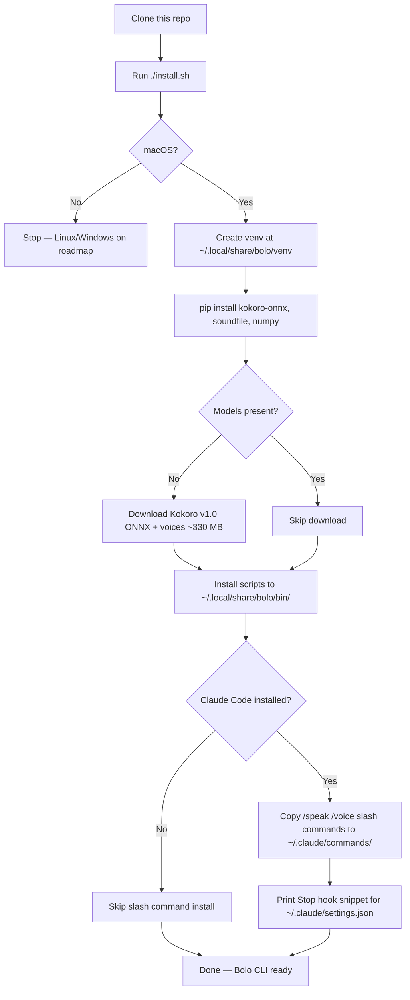
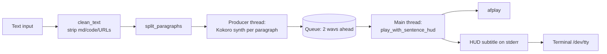

# Bolo

> Local TTS for the terminal — Kokoro voice with a live subtitle HUD synced to playback.

Bolo (Hindi: *"speak"*) reads any text aloud through your terminal using a fully local Kokoro TTS model — no API calls, no tokens, no network. While the audio plays, a single-line subtitle HUD appears in the input area at the bottom of your terminal and advances in sync with the voice, so you can glance down to see exactly where in the text the voice is right now without having to re-read from the top.

It ships out of the box with a Claude Code integration: every assistant response gets spoken as soon as it finishes, with the HUD running below it. Use it for accessibility, eyes-free work, dictation-driven coding workflows, or just listening to your AI agent while you make coffee.

54 voices across 9 languages. Mac-only for v0.1 — Linux and Windows on the roadmap.

---

## Features

- **Fully local.** Kokoro v1.0 ONNX model runs on-device. No network calls. No tokens. $0/month.
- **Live subtitle HUD.** A single line at the bottom of your terminal shows the current sentence as it plays. Pinned in place — never wraps, never scrolls, never collides with the response above.
- **Sentence-accurate sync.** Word and punctuation-weighted timing keeps the subtitle aligned with the voice even on long, comma-heavy prose.
- **Smooth paragraph prosody.** Each paragraph synthesised in one Kokoro call so the audio flows naturally — no robotic per-sentence breaks.
- **Pipelined synthesis.** Producer-consumer queue means the next paragraph is synthesised in a background thread while the current one plays. Zero gaps between paragraphs after the first.
- **Claude Code integration.** Stop hook auto-reads each response. Slash commands `/speak`, `/voice`. Works in Warp, iTerm2, and the macOS terminal.
- **54 voices, 9 languages.** American, British, Hindi, Spanish, French, Italian, Japanese, Mandarin, Portuguese — both genders.

---

## Quick demo

```text
$ echo "Hello from Bolo. This subtitle is pinned to the bottom of your terminal." | bolo
▶ [1/2] Hello from Bolo.
▶ [2/2] This subtitle is pinned to the bottom of your terminal.
```

The HUD line rewrites itself in place as the audio progresses. When playback ends, the line clears and you are back at your normal prompt.

---

## How install works



---

## Requirements

### Hardware

- **macOS** — Apple Silicon (M1/M2/M3/M4) recommended for sub-second warm synthesis. Intel Macs work but synthesis is 2–4× slower.
- **RAM:** 1.5 GB free during synthesis (model + ONNX runtime + audio buffers).
- **Disk:** ~400 MB total — Kokoro model (~310 MB) + voices file (~28 MB) + venv (~60 MB).
- **Audio output** — any Mac speaker or paired Bluetooth/output device.

### Software

| Component | Minimum | Notes |
|---|---|---|
| **macOS** | 11 Big Sur | tested on Sonoma & Sequoia |
| **Python** | 3.10 | the system `python3` on stock macOS is 3.9 — install a newer one (see below) |
| `afplay` | bundled | ships with macOS |
| `curl`   | bundled | ships with macOS |
| `jq`     | optional but recommended | `brew install jq` (only needed for Stop-hook auto-read flow) |
| **Claude Code** | optional | needed only for `/speak` & `/voice` slash commands and the Stop-hook integration |

### Installing Python 3.10+

The `python3` that ships with macOS is 3.9 and will not work. Install a newer Python via Homebrew:

```bash
brew install python@3.12   # or python@3.11, python@3.13
```

`install.sh` auto-detects any of `python3.13`, `python3.12`, `python3.11`, `python3.10` on your `PATH` (in that order) and falls back to plain `python3` only if it is ≥3.10. You do not need to make the new Python your default `python3` — Bolo's venv pins to whichever interpreter the installer found.

### Network

Required only during install for the one-time model download (~330 MB combined). After that, Bolo runs fully offline.

---

## Install

```bash
git clone https://github.com/sumanthmukkala/bolo.git
cd bolo
./install.sh
```

The installer:

1. Creates a virtualenv at `~/.local/share/bolo/venv`
2. Installs Python dependencies (`kokoro-onnx`, `soundfile`, `numpy`)
3. Downloads the Kokoro ONNX model and voices file (one-time, ~330 MB combined)
4. Copies the Bolo scripts into `~/.local/share/bolo/bin/`
5. Writes a default `config.json` if none exists
6. If Claude Code is installed, copies `/speak` and `/voice` slash commands into `~/.claude/commands/`
7. Optionally prints the Stop-hook snippet for `~/.claude/settings.json`

To put `bolo` on your PATH:

```bash
echo 'export PATH="$HOME/.local/share/bolo/bin:$PATH"' >> ~/.zshrc
source ~/.zshrc
```

---

## Usage

### Standalone CLI

```bash
bolo "Hello world."                      # speak inline text
echo "Long text from a file" | bolo      # pipe stdin
bolo --voice af_bella "Different voice"  # one-shot voice override
bolo --speed 1.2 "Faster"                # speed override
bolo --list-voices                       # list all 54 voices
bolo --version                            # version + license
```

### Claude Code

After installing, these slash commands are available in any Claude Code session:

- `/speak <text>` — read text now
- `/speak last` — re-read the last assistant response
- `/speak stop` — kill audio
- `/speak skip` — skip the next auto-read once
- `/speak auto on|off` — toggle persistent auto-read on Stop
- `/voice list` — list all 54 voices
- `/voice <name>` — switch active voice
- `/voice sample <name>` — preview a voice without changing the active one

To enable auto-read of every response, add the Stop hook to `~/.claude/settings.json`:

```json
{
  "hooks": {
    "Stop": [
      {
        "hooks": [
          { "type": "command", "command": "$HOME/.local/share/bolo/bin/stop-hook.sh" }
        ]
      }
    ]
  }
}
```

Then `/speak auto on` to enable, `/speak auto off` to disable.

---

## Configuration

`~/.local/share/bolo/config.json`:

```json
{
  "active_voice": "am_michael",
  "auto_read": false,
  "speed": 1.0,
  "skip_code_blocks": true,
  "skip_urls": true,
  "max_chars_per_chunk": 250,
  "hud": true
}
```

| Field | Default | Purpose |
|---|---|---|
| `active_voice` | `am_michael` | Voice id (see `/voice list`) |
| `auto_read` | `false` | Auto-read on Claude Code Stop hook |
| `speed` | `1.0` | Playback rate (0.5–2.0) |
| `skip_code_blocks` | `true` | Strip code blocks before synthesis |
| `skip_urls` | `true` | Replace URLs with `(link)` |
| `max_chars_per_chunk` | `250` | Cap for the runaway-sentence safety split |
| `hud` | `true` | Show the live subtitle line |

---

## Voices

54 voices across 9 languages. Naming convention: `[language][gender]_<name>`.

| Prefix | Language | Gender | Voices |
|---|---|---|---|
| `af_*` | American English | female | alloy, aoede, bella, heart, jessica, kore, nicole, nova, river, sarah, sky |
| `am_*` | American English | male | adam, echo, eric, fenrir, liam, michael, onyx, puck, santa |
| `bf_*` | British English | female | alice, emma, isabella, lily |
| `bm_*` | British English | male | daniel, fable, george, lewis |
| `ef_*` / `em_*` | Spanish | f / m | dora; alex, santa |
| `ff_*` | French | female | siwis |
| `hf_*` / `hm_*` | Hindi | f / m | alpha, beta; omega, psi |
| `if_*` / `im_*` | Italian | f / m | sara; nicola |
| `jf_*` / `jm_*` | Japanese | f / m | alpha, gongitsune, nezumi, tebukuro; kumo |
| `pf_*` / `pm_*` | Portuguese | f / m | dora; alex, santa |
| `zf_*` / `zm_*` | Mandarin | f / m | xiaobei, xiaoni, xiaoxiao, xiaoyi; yunjian, yunxi, yunxia, yunyang |

Recommended starting voices: `am_michael` (default, neutral American male), `am_puck` (warm), `af_bella` (clear American female), `bm_george` (British male).

`bolo --list-voices` prints the full grouped list at any time.

---

## Latency

Measured on Apple Silicon (M-series):

| Phase | Time |
|---|---|
| Cold start (first invocation, model load) | 3–5 s |
| Warm synthesis per paragraph | ~0.5–1 s |
| Audio time-to-first-sound | ~150 ms after synth completes |
| Per-paragraph gap during playback | ~0 ms (pipelined synth in background thread) |

The first response on a new session takes the longest because the Kokoro model has to load. Subsequent responses re-use the same Python process when called from the Stop hook, but cold-start the model again on each `/speak` invocation. (Future: persistent daemon to remove cold-start.)

---

## Architecture



Key design choices:

- **Synth unit = paragraph**, **HUD unit = sentence sub-chunk.** Decouples smooth audio prosody from fine-grained subtitle granularity.
- **Producer-consumer queue** with depth 2 to keep the next paragraph ready before the current one finishes.
- **Char-proportional → word-and-punctuation-weighted timing** for HUD advance. Period weight 3.8, comma weight 1.8, dash weight 0.7.
- **Single-line HUD**, rewritten in place via `\r\033[K`. Word-aware truncation if a sub-chunk exceeds terminal width — never wraps, never scrolls.
- **Stop hook redirects stderr to `/dev/tty`** so the HUD reaches your terminal even though the hook itself runs as a background fork.

---

## Roadmap

- [ ] **Optional `--precise-sync` flag** using `aeneas` forced alignment for sample-accurate subtitle timing.
- [ ] **Persistent daemon mode** to eliminate cold-start latency on each `/speak` invocation.
- [ ] **Linux + Windows support** via `sounddevice` (PortAudio) replacing `afplay`.
- [ ] **Streaming synthesis** so audio starts before the full paragraph is rendered.
- [ ] **Word-level highlight within sub-chunks** for full karaoke-style read-along.

---

## Troubleshooting

### `Python 3.10+ required (found 3.9)`

The system `python3` on stock macOS is 3.9 and Bolo needs ≥3.10. Install a newer Python via Homebrew:

```bash
brew install python@3.12
```

Then re-run `./install.sh`. The installer auto-detects `python3.13`, `python3.12`, `python3.11`, or `python3.10` on your `PATH` — you do not need to make it the default.

### `bolo: command not found`

Bolo installs to `~/.local/share/bolo/bin/bolo`. Add it to your `PATH`:

```bash
echo 'export PATH="$HOME/.local/share/bolo/bin:$PATH"' >> ~/.zshrc
source ~/.zshrc
```

Or invoke it directly: `~/.local/share/bolo/bin/bolo "Hello"`.

### Slash commands `/speak` or `/voice` do nothing in Claude Code

Claude Code reads slash commands from `~/.claude/commands/`. Confirm they were copied:

```bash
ls ~/.claude/commands/ | grep -E 'speak|voice'
```

If missing, re-run `./install.sh` — the slash-command copy step is at the end.

### Auto-read isn't firing on Claude Code responses

Three things must be true:

1. `~/.claude/settings.json` contains a `Stop` hook entry pointing at `~/.local/share/bolo/bin/stop-hook.sh`. `install.sh` prints the snippet to add.
2. `~/.local/share/bolo/config.json` has `"auto_read": true`. Toggle with `/speak auto on`.
3. `jq` must be installed (`brew install jq`) — the Stop hook uses it to parse the transcript.

### HUD subtitle line is invisible / appears in a log file instead

The Stop hook redirects stderr to `/dev/tty` so the HUD reaches your terminal. If you have customised the hook or are running it in an unusual context (background daemon, headless terminal), `/dev/tty` may not be writable. Workaround: run Bolo in the foreground via `bolo "<text>"` directly, where stderr is already attached to your terminal.

### HUD slightly out of sync with audio

The default punctuation weights (period 3.8, comma 1.8, dash 0.7) are tuned for Kokoro v1.0 American voices at speed 1.0. If you use a different voice or non-default speed and notice drift, edit the weights in `tts.py` (`_timing_units` function). Higher weight = the HUD waits longer at that punctuation. The roadmap includes an optional `--precise-sync` flag using `aeneas` forced alignment for sample-accurate timing without manual tuning.

---

## Credits

Bolo wraps [Kokoro v1.0](https://github.com/thewh1teagle/kokoro-onnx) by `thewh1teagle`, an MIT-licensed ONNX port of the [Kokoro TTS](https://huggingface.co/hexgrad/Kokoro-82M) model by `hexgrad`. All voice quality is theirs; Bolo only adds the terminal HUD, sync timing, paragraph pipelining, and Claude Code integration.

If you ship Bolo, please pass that credit forward.

---

## License

MIT — see [LICENSE](./LICENSE). Use it freely, including commercially. Attribution appreciated but not required.

Built by [Sumanth Mukkala](https://github.com/sumanthmukkala).
